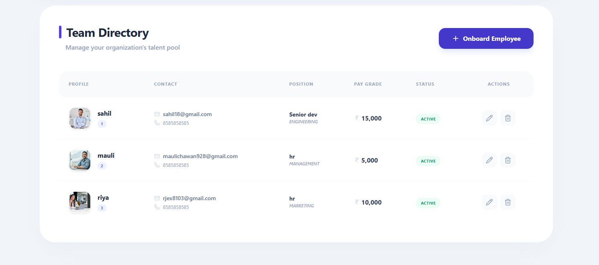

# 🧑‍💼 Employee Management System (CRUD Router App)
📝 Project Description

The Employee Management System is a React-based offline CRUD application designed to help learners understand:

React state management

Form handling with controlled components

Component-to-component communication

Event-driven UI updates

localStorage integration

---

## 🚀 Features

| Feature             | Description                                   |
| ------------------- | --------------------------------------------- |
| ➕ Add Employee      | Add employee details with image upload        |
| 📄 View Employees   | Display all employees in a table              |
| ✏️ Edit Employee    | Update employee details using dynamic routing |
| 🗑️ Delete Employee | Remove employee with instant UI update        |
| 💾 LocalStorage     | Data persists even after page refresh         |
| 🧭 React Router     | Smooth navigation between pages               |
| 🖼️ Image Upload    | Store and display employee images             |
| 📱 Responsive UI    | Clean and simple user interface               |

---


## 📂 Project Structure

```
CRUD-Router-app/
│── src/
│   ├── components/
│   │   └── Navbar.jsx
│   ├── pages/
│   │   ├── Home.jsx
│   │   ├── addEmployee.jsx
│   │   ├── viewEmployee.jsx
│   │   └── updateEmployee.jsx
│   ├── assets/
│   ├── App.jsx
│   ├── main.jsx
│   └── index.css
│── package.json
│── vite.config.js
│── index.html
```

---


## 🧠 How It Works

* Employee data is stored in **browser LocalStorage**
* CRUD operations update both **state & LocalStorage**
* `useParams()` is used for dynamic edit routing
* `useEffect()` loads stored data on component mount

---
  


📜 License

This project is developed for educational purposes only.


---


